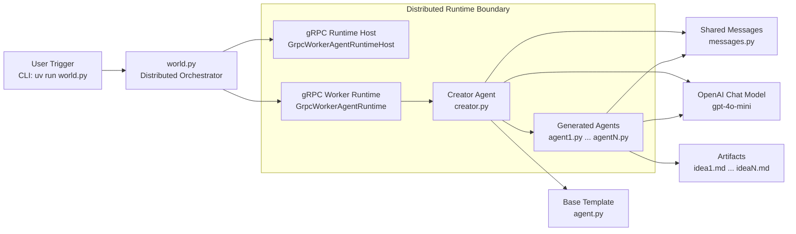
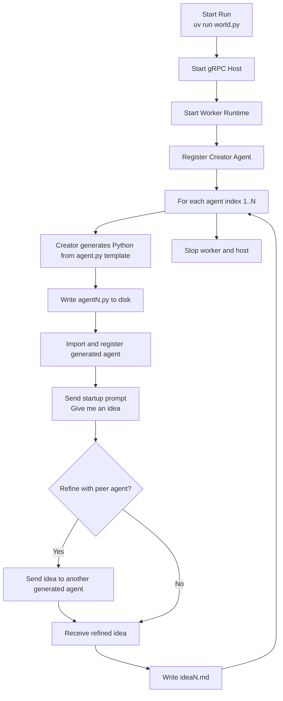

# Self-Replicating Agent System (AutoGen Core)

Distributed multi-agent orchestration system that generates, registers, and runs new agents at runtime using AutoGen Core, gRPC workers, and dynamic Python code synthesis.

## Demo Surface

[](https://huggingface.co/spaces/cameronbell/self-replicating-agent-system)

- Hugging Face demo: constrained single-process demo lives in the separate HF Space project. Add the public Space URL here once finalized.
- Render deployment: planned advanced deployment target for the full distributed runtime, kept separate from the recruiter demo path.

This repository is the source-of-truth for the distributed core architecture. The demo surfaces sit around it; they are not the primary implementation in this repo.

## Architecture

`world.py` starts a distributed gRPC runtime, registers a `Creator` agent, and concurrently asks it to generate and run `N` new agents. The creator uses `agent.py` as a template, writes new Python modules, imports them into the runtime, prompts them for ideas, and writes those outputs to `idea{i}.md`.

- `world.py`: orchestrator and concurrent distributed runner.
- `creator.py`: meta-agent that writes, imports, and registers new agents.
- `agent.py`: base agent template used for generation.
- `messages.py`: shared message schema and random recipient selection.



## Problem

Most agent demos show a fixed team of predefined roles. That makes it hard to demonstrate deeper systems skill around runtime orchestration, distributed execution, dynamic agent creation, and lifecycle management.

This project focuses on that harder systems problem: proving that an AI runtime can create new agents from code templates, register them into a distributed execution environment, coordinate their work, and collect artifacts from the run.

## Solution / What It Does

The core system treats agent generation itself as part of the runtime:

1. `world.py` starts the gRPC host and worker runtime.
2. `Creator` receives requests to create `agent{i}.py` files.
3. It uses `agent.py` as a base template and synthesizes a distinct agent implementation.
4. The generated module is imported and registered into the runtime.
5. The new agent produces a startup business idea.
6. Agents can optionally bounce ideas to peer agents for refinement.
7. Final outputs are written to `idea{i}.md`.

This is the original distributed path and remains the default documented runtime for the repo.

## Key Features

- Distributed AutoGen runtime using gRPC host/worker execution.
- Dynamic agent creation from a Python template at runtime.
- Concurrent generation and execution across multiple agents.
- Optional peer-to-peer refinement between generated agents.
- File-based output artifacts that make every run inspectable.
- Preserved notebooks and community contributions that show the project’s experimental lineage.

## Tech Stack

- Python 3.12
- AutoGen Core
- AutoGen AgentChat
- AutoGen gRPC runtime extensions
- OpenAI API
- `uv`
- Mermaid

## Agent Workflow



Editable Mermaid sources live in [`docs/diagrams/`](docs/diagrams/). The deeper [data flow diagram](docs/diagrams/data-flow.mmd) is documented in [docs/README.md](docs/README.md).

## Repository Layout

- `world.py`: distributed runtime entrypoint for the baseline system.
- `creator.py`: creator/meta-agent responsible for generating and registering new agents.
- `agent.py`: template class used to synthesize specialized agent variants.
- `messages.py`: shared message contract and runtime recipient selection.
- `examples/`: curated business-idea outputs from prior runs.
- `docs/`: Mermaid diagram sources and supporting documentation.
- `notebooks/*_lab*.ipynb`: historical exploratory notebooks retained for reference.

## Sample Outputs

Curated examples are included in `examples/`:

- `examples/finance-quest-gamified-finance.md`
- `examples/smart-credit-ecosystem.md`
- `examples/ai-real-estate-investment-analyzer.md`

## Results / Evidence

This repository is positioned as a systems-engineering portfolio piece rather than a benchmark report. The evidence is in the implementation shape and outputs:

- The runtime creates and registers new agents dynamically instead of relying on a fixed pre-authored team.
- The orchestration path is distributed and gRPC-based, which is the key architectural differentiator from the simplified demo deployment.
- The curated sample outputs show that generated agents produce distinct ideas and can refine one another’s work.
- The docs and diagrams make the runtime boundaries, generation loop, and artifact flow explicit for technical reviewers.

## Run

Prereqs:

- Python 3.12+
- `uv` installed locally
- `OPENAI_API_KEY` available via environment or `.env`
- `.env.example` copied to `.env` if you want dotenv-based local config

This repo pins `uv` to Python 3.12 via `.python-version` so the distributed runtime uses the same interpreter target as the documented setup.

From the repo root:

```bash
uv sync
cp .env.example .env
uv run world.py
```

To install the optional notebook stack for the exploratory lab notebooks:

```bash
uv sync --extra notebooks
```

The default runtime path remains the original distributed gRPC flow in `world.py`. The notebooks are preserved as exploratory/reference assets and use the optional extra rather than the base install.

## Notes

- Runtime endpoint is currently `localhost:50051`.
- The model in this setup is `gpt-4o-mini`.
- Generated outputs are non-deterministic because of model randomness and agent-to-agent refinement.
- Generated runtime artifacts such as `agentN.py` and `ideaN.md` are intentionally gitignored so repeated runs do not dirty the repo.
- The Hugging Face deployment is intentionally a constrained demo surface; this repo remains centered on the distributed runtime.
