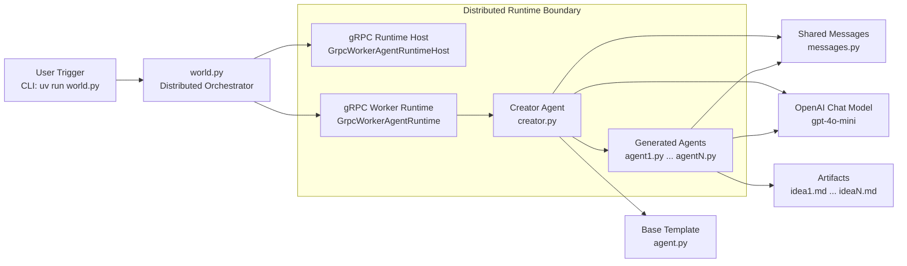
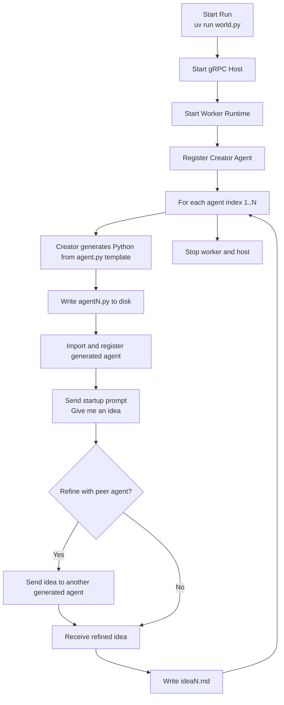

# Self-Replicating Agent System (AutoGen Core)

This project demonstrates a distributed, self-expanding multi-agent workflow built with AutoGen Core + AgentChat.

## What It Does

`world.py` starts a gRPC runtime, registers a `Creator` agent, and concurrently asks it to generate and run `N` new agents.

For each generated agent:

1. `Creator` uses `agent.py` as a template.
2. It writes new Python code (`agent{i}.py`) with a distinct system prompt.
3. It dynamically imports and registers that new agent in the runtime.
4. It asks the new agent for a startup business idea.
5. The result is saved as `idea{i}.md`.

Generated agents can optionally bounce ideas to other generated agents for refinement.

## Architecture

- `world.py`: Orchestrator and concurrent runner (`HOW_MANY_AGENTS`).
- `creator.py`: Meta-agent that writes, imports, and registers new agents.
- `agent.py`: Base agent template used for generation.
- `messages.py`: Shared message schema and random recipient selection.



## Agent Workflow



Editable Mermaid sources live in [`docs/diagrams/`](docs/diagrams/). The deeper [data flow diagram](docs/diagrams/data-flow.mmd) is documented in [docs/README.md](docs/README.md).

## Run

Prereqs:

- Python 3.12+
- `uv` installed locally
- `OPENAI_API_KEY` available via environment or `.env`
- `.env.example` copied to `.env` if you want dotenv-based local config

This repo pins `uv` to Python 3.12 via `.python-version` so the distributed runtime uses the same interpreter target as the documented setup.

From the repo root:

```bash
uv sync
cp .env.example .env
uv run world.py
```

To install the optional notebook stack for the exploratory lab notebooks:

```bash
uv sync --extra notebooks
```

The default runtime path remains the original distributed gRPC flow in `world.py`. The notebooks are preserved as exploratory/reference assets and use the optional extra rather than the base install.

## Sample Outputs

Curated examples are included in `examples/`:

- `examples/finance-quest-gamified-finance.md`
- `examples/smart-credit-ecosystem.md`
- `examples/ai-real-estate-investment-analyzer.md`

## Repository Layout

- `world.py`: distributed runtime entrypoint for the baseline system.
- `creator.py`: creator/meta-agent responsible for generating and registering new agents.
- `agent.py`: template class used to synthesize specialized agent variants.
- `messages.py`: shared message contract and runtime recipient selection.
- `examples/`: curated business-idea outputs from prior runs.
- `docs/`: Mermaid diagram sources and supporting documentation.
- `community_contributions/`: preserved variants and lab material from the original project lineage.
- `*_lab*.ipynb`: historical exploratory notebooks retained for reference.

## Notes

- Runtime endpoint is currently `localhost:50051`.
- The model in this setup is `gpt-4o-mini`.
- Generated outputs are non-deterministic because of model randomness and agent-to-agent refinement.
- Generated runtime artifacts such as `agentN.py` and `ideaN.md` are intentionally gitignored so repeated runs do not dirty the repo.
